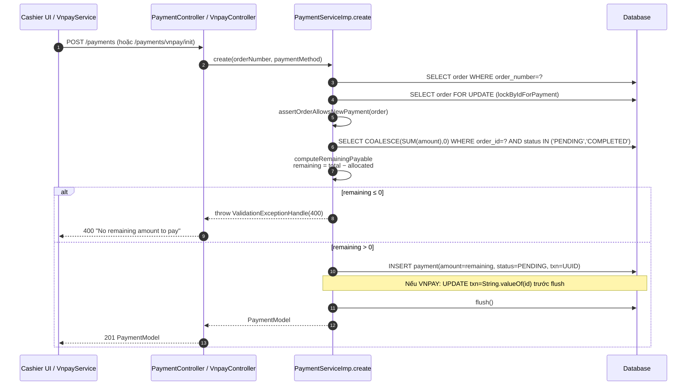
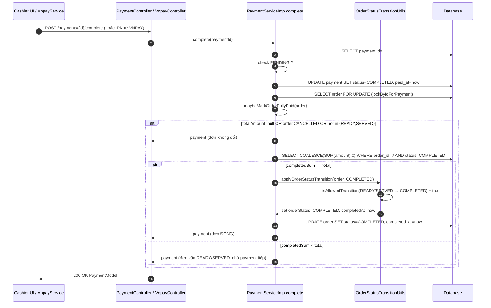

# Payment — Helper Methods Reference

Tài liệu mô tả chi tiết các **helper nghiệp vụ chính** trong `PaymentServiceImp` cùng toàn bộ helper/util/repository mà chúng phụ thuộc:

- **`computeRemainingPayable`** — chốt số tiền cho payment mới (luồng `create`).
- **`maybeMarkOrderFullyPaid`** — tự động đóng đơn khi đủ tiền (luồng `complete`).

Mục đích: khi đọc code lần đầu hoặc onboard người mới, có 1 chỗ tổng hợp các "mảnh ghép" liên quan thay vì phải nhảy qua 4-5 file.

> File liên quan
>
> - `backend/app/src/main/java/com/app/services/imp/PaymentServiceImp.java`
> - `backend/app/src/main/java/com/app/utils/OrderStatusTransitionUtils.java`
> - `backend/common/src/main/java/com/common/repositories/PaymentRepository.java`
> - `backend/common/src/main/java/com/common/repositories/OrderRepository.java`

---

## 1. Bức tranh tổng thể

Vòng đời tiền trong 1 đơn:

```text
create(orderNumber, paymentMethod)
     │
     ├─ assertOrderAllowsNewPayment(order)             ← gate điều kiện đơn
     ├─ orderRepository.lockByIdForPayment(orderId)    ← lock row order
     ├─ computeRemainingPayable(order)                 ← MAIN SUBJECT (mục 2)
     │       │
     │       ├─ sumAmountByOrderIdAndPaymentStatuses({PENDING,COMPLETED})
     │       ├─ remaining = totalAmount − allocated
     │       └─ throw nếu remaining ≤ 0
     └─ INSERT PaymentEntity(amount=remaining, status=PENDING)

complete(paymentId)
     │
     ├─ Đổi payment: PENDING → COMPLETED
     ├─ orderRepository.lockByIdForPayment(orderId)
     └─ maybeMarkOrderFullyPaid(order)                 ← MAIN SUBJECT (mục 3)
             │
             ├─ Bộ lọc điều kiện (sớm thoát)
             ├─ sumCompletedAmountByOrderId            ← chỉ {COMPLETED}
             ├─ So sánh với totalAmount
             └─ Nếu bằng → applyOrderStatusTransition(COMPLETED)
                     │
                     ├─ Validate transition (READY/SERVED → COMPLETED hợp lệ)
                     ├─ Set orderStatus = COMPLETED
                     └─ Set completedAt = now()
```

Hai helper này **đối xứng** nhau:

| Khía cạnh | `computeRemainingPayable` | `maybeMarkOrderFullyPaid` |
|---|---|---|
| Pha trong vòng đời | **Bắt đầu** payment | **Kết thúc** payment |
| Caller | `create(...)` | `complete(...)` |
| Câu hỏi đặt ra | "Còn bao nhiêu chưa thu?" | "Đã thu đủ chưa? Có nên đóng đơn?" |
| Tính tổng theo status | `{PENDING, COMPLETED}` (đang giữ chỗ) | `{COMPLETED}` (đã thu thật) |
| Khi không đạt điều kiện | **Throw 400** (chặn tạo) | **Return im lặng** (đơn ở yên) |
| Side-effect | Không (thuần tính toán) | Có thể UPDATE `orders` |

---

## 2. `computeRemainingPayable` — từng bước

```java
/** Số tiền còn lại của đơn = total − Σ(PENDING + COMPLETED); server tự tính để tránh nhập sai/tampering. */
private BigDecimal computeRemainingPayable(OrderEntity order, LogContext logContext) {
    BigDecimal allocated = Objects.requireNonNullElse(
        paymentRepository.sumAmountByOrderIdAndPaymentStatuses(order.getId(), ALLOCATING_STATUSES),
        BigDecimal.ZERO
    ).setScale(AMOUNT_SCALE, RoundingMode.HALF_UP);
    BigDecimal totalCap = order.getTotalAmount().setScale(AMOUNT_SCALE, RoundingMode.HALF_UP);
    BigDecimal remaining = totalCap.subtract(allocated);
    if (remaining.compareTo(BigDecimal.ZERO) <= 0) {
        ValidationExceptionHandle e = new ValidationExceptionHandle(
            "No remaining amount to pay (order fully allocated or has PENDING payment)",
            Collections.singletonList(order.getId()),
            "PaymentModel"
        );
        log.logError(e.getMessage(), e, logContext);
        throw e;
    }
    return remaining;
}
```

### 2.1. Mục đích

Server **tự tính** số tiền cho `PaymentEntity.amount` của lần `create` này — thay thế việc nhận `amount` từ client (đã bỏ trong refactor). Đảm bảo:

- Không nhập sai (UI bug, lỗi người dùng).
- Không tampering (hacker sửa devtools).
- Không vượt `totalAmount` (chặn từ gốc).
- Đồng bộ với VNPAY (cùng một cách tính ở 2 nhánh CASH/VNPAY).

### 2.2. Công thức

```text
remaining = totalAmount − Σ(amount của payment có status ∈ {PENDING, COMPLETED})
```

| Status | Có cộng vào `allocated` không? | Giải thích |
|---|---|---|
| `PENDING` | ✓ | "Đang giữ chỗ" — đã khởi tạo phiên thanh toán, chưa biết khách trả thật hay không. Phải tính để tránh tạo song song nhiều payment vượt tổng. |
| `COMPLETED` | ✓ | Đã hoàn tất — chắc chắn đã thu. |
| `FAILED` | ✗ | Cổng từ chối → giải phóng quota. |
| `CANCELLED` | ✗ | Người dùng huỷ → giải phóng quota. |

→ `ALLOCATING_STATUSES = {PENDING, COMPLETED}` chính là 2 status "đang chiếm chỗ" trong quota tổng đơn.

### 2.3. Vì sao phải cộng cả `PENDING`?

Kịch bản nếu **không** cộng `PENDING`:

1. Cashier khởi tạo VNPAY cho đơn 540.000đ → payment#1 PENDING.
2. Trong khi khách đang quét QR (chưa COMPLETE), cashier khởi tạo VNPAY tiếp → tính `allocated = sum(COMPLETED) = 0` → `remaining = 540.000` → tạo thành công payment#2.
3. Khách trả cả 2 (hoặc trả 1 thì payment#1 COMPLETED, payment#2 vẫn PENDING nhưng vô nghĩa). DB ghi nhận 1.080.000đ cho đơn 540.000đ → đối soát sai.

→ Cộng `PENDING` chặn ngay từ bước 2.

### 2.4. Logic từng dòng

| Dòng | Hành động | Vì sao |
|---|---|---|
| 352-355 | Query `SUM(amount)` cho `ALLOCATING_STATUSES`, fallback `ZERO`, normalize scale | 3 lớp phòng thủ null (xem mục 3.2) + chuẩn hoá scale=2 |
| 356 | Normalize `totalCap` cùng scale | `subtract` ra kết quả có scale ổn định |
| 357 | `remaining = totalCap − allocated` | Phép trừ thuần |
| 358-366 | Nếu `remaining ≤ 0` → throw `ValidationExceptionHandle` (HTTP 400) | Xảy ra khi: (a) đơn đã thu đủ; (b) đang có payment PENDING khác chiếm hết quota |
| 367 | Return `remaining` | Caller (`create`) set vào `paymentEntity.setAmount(remaining)` |

### 2.5. Phụ thuộc concurrency

`computeRemainingPayable` **phải** chạy trong transaction đã lock `order` (qua `lockByIdForPayment`). Nếu không lock:

```text
T1 (cashier A)                          T2 (cashier B)
─────────────────────────────────       ─────────────────────────────────
SELECT order id=7                       SELECT order id=7
computeRemainingPayable → 540.000       computeRemainingPayable → 540.000
INSERT payment(540.000, PENDING)        INSERT payment(540.000, PENDING)
COMMIT                                  COMMIT
                                        → tổng PENDING = 1.080.000 vượt 540.000 đơn
```

`PESSIMISTIC_WRITE` lock trên row `orders` chặn vấn đề này — xem mục 6.

### 2.6. Trả về cho ai

Trong `create()`:

```java
BigDecimal amount = computeRemainingPayable(order, logContext);
...
paymentEntity.setAmount(amount);  // ← cho CASH
// hoặc VnpayPaymentServiceImpl đọc lại saved.getAmount() để build vnp_Amount
```

→ Đồng nhất giá trị giữa DB và URL VNPAY (`vnp_Amount = amount × 100`).

---

## 3. `maybeMarkOrderFullyPaid` — từng bước

```java
private void maybeMarkOrderFullyPaid(OrderEntity order, LogContext logContext) {
    if (order.getTotalAmount() == null || order.getOrderStatus() == OrderStatus.CANCELLED) {
        return;
    }
    if (!ALLOW_AUTO_COMPLETE_ON_FULL_PAYMENT.contains(order.getOrderStatus())) {
        return;
    }
    BigDecimal completedSum = Objects.requireNonNullElse(
        paymentRepository.sumCompletedAmountByOrderId(order.getId()),
        BigDecimal.ZERO
    ).setScale(AMOUNT_SCALE, RoundingMode.HALF_UP);
    BigDecimal total = order.getTotalAmount().setScale(AMOUNT_SCALE, RoundingMode.HALF_UP);
    if (completedSum.compareTo(total) == 0) {
        OrderStatusTransitionUtils.applyOrderStatusTransition(order, OrderStatus.COMPLETED);
        orderRepository.save(order);
        log.logInfo("Order " + order.getId() + " marked COMPLETED (payments cover total)", logContext);
    }
}
```

### 3.1. Bộ lọc điều kiện đầu vào (sớm thoát)

| Lớp | Điều kiện thoát | Lý do |
|---|---|---|
| Lớp 1 | `totalAmount == null` | Đơn chưa được "finalize" (chốt giá). Không có cơ sở để so sánh tổng đã trả vs tổng đơn. |
| Lớp 1 | `orderStatus == CANCELLED` | Đơn đã huỷ trước đó. Dù khách lỡ thanh toán xong rồi (hiếm) cũng không đóng — phải refund/đối soát thủ công. |
| Lớp 2 | `orderStatus ∉ ALLOW_AUTO_COMPLETE_ON_FULL_PAYMENT` | Quy trình phục vụ chưa tới bước "có thể đóng đơn". |

Hằng số `ALLOW_AUTO_COMPLETE_ON_FULL_PAYMENT`:

```java
private static final EnumSet<OrderStatus> ALLOW_AUTO_COMPLETE_ON_FULL_PAYMENT =
    EnumSet.of(OrderStatus.READY, OrderStatus.SERVED);
```

→ Chỉ cho phép tự động đóng đơn khi:

- `READY`: bếp đã làm xong, chờ phục vụ ra bàn.
- `SERVED`: đã phục vụ ra bàn.

Vì sao **không** mở rộng sang `CONFIRMED` / `PREPARING`?

| Status | Vì sao chặn |
|---|---|
| `CONFIRMED` | Mới chốt menu, bếp chưa nhận. Khách trả tiền trước → vẫn không nên đóng đơn (rủi ro huỷ món, đổi món). |
| `PREPARING` | Bếp đang làm. Đóng đơn lúc này sẽ làm mất khả năng cập nhật trạng thái tiếp (vì `COMPLETED` là terminal). |

Triết lý: **thanh toán ≠ kết thúc dịch vụ**. Chỉ đóng đơn khi cả 2 trục (tiền + phục vụ) đều xong.

### 3.2. Tính `completedSum`

```java
BigDecimal completedSum = Objects.requireNonNullElse(
    paymentRepository.sumCompletedAmountByOrderId(order.getId()),
    BigDecimal.ZERO
).setScale(AMOUNT_SCALE, RoundingMode.HALF_UP);
```

3 lớp phòng thủ null:

1. **Tại SQL**: query dùng `COALESCE(SUM(p.amount), 0)` — không có row nào vẫn ra `0` chứ không phải `NULL`.
2. **Tại Java**: `Objects.requireNonNullElse(..., BigDecimal.ZERO)` — defensive nếu JPA driver/Hibernate bất ngờ trả `null` (vd version bug hoặc bị mock).
3. **Normalize scale**: `setScale(2, HALF_UP)` đảm bảo `compareTo` ổn định.

### 3.3. Normalize `total`

```java
BigDecimal total = order.getTotalAmount().setScale(AMOUNT_SCALE, RoundingMode.HALF_UP);
```

`AMOUNT_SCALE = 2`. Áp scale=2 để hai vế cùng "format" trước khi so sánh.

> Lưu ý: `BigDecimal("540000").compareTo(new BigDecimal("540000.00")) == 0` (cùng giá trị) — nên về mặt logic không bắt buộc phải `setScale`. Nhưng làm để giảm rủi ro nếu sau này đổi sang `equals()` hoặc serialize ra DB (mỗi nơi có thể đối xử khác nhau).

### 3.4. So sánh + đóng đơn

```java
if (completedSum.compareTo(total) == 0) {
    OrderStatusTransitionUtils.applyOrderStatusTransition(order, OrderStatus.COMPLETED);
    orderRepository.save(order);
    log.logInfo(...);
}
```

- Chỉ đóng khi `completedSum == total` **chính xác**.
- Không có nhánh "completedSum > total" — vì `computeRemainingPayable` đã chặn từ phía `create` (không thể tạo payment làm vượt tổng).
- Trường hợp `completedSum < total`: phương thức kết thúc lặng lẽ, đơn ở yên trạng thái cũ (`READY`/`SERVED`), chờ payment tiếp theo.

`OrderStatusTransitionUtils.applyOrderStatusTransition` → xem mục 5.

`orderRepository.save(order)` để JPA phát UPDATE. Vì đã `lockByIdForPayment` trước đó, không có concurrent write nào chen vào giữa.

---

## 4. Repository helper — `sumAmountByOrderIdAndPaymentStatuses` + shortcut

File: `backend/common/src/main/java/com/common/repositories/PaymentRepository.java`

```java
@Query("SELECT COALESCE(SUM(p.amount), 0) FROM PaymentEntity p WHERE p.orderId = :orderId AND p.paymentStatus IN (:statuses)")
BigDecimal sumAmountByOrderIdAndPaymentStatuses(@Param("orderId") Integer orderId, @Param("statuses") Collection<PaymentStatus> statuses);

/** Tổng đã COMPLETED — dùng để khớp đủ tiền với Order.totalAmount. */
default BigDecimal sumCompletedAmountByOrderId(Integer orderId) {
    return sumAmountByOrderIdAndPaymentStatuses(orderId, List.of(PaymentStatus.COMPLETED));
}
```

### 4.1. Vì sao có hai method

- `sumAmountByOrderIdAndPaymentStatuses(orderId, statuses)` — **method gốc**, linh hoạt với bất kỳ tổ hợp status nào. Được `computeRemainingPayable` dùng với `ALLOCATING_STATUSES = {PENDING, COMPLETED}`.
- `sumCompletedAmountByOrderId(orderId)` — **method tiện ích** (`default`), shortcut khi chỉ cần `{COMPLETED}`. Tránh việc mỗi caller phải nhớ truyền `List.of(PaymentStatus.COMPLETED)`.

### 4.2. Tính chất của câu query

- `COALESCE(SUM(...), 0)`: không có row → 0, không phải null. Trả về `BigDecimal.ZERO` về Java.
- `p.orderId` đối chiếu với cột `order_id` trong bảng `payments` (không qua association, dùng `@Column(name = "order_id", insertable=false, updatable=false)` trên entity).
- `IN (:statuses)`: truyền `List<PaymentStatus>` hoặc bất kỳ `Collection` — JPA tự sinh `IN ('PENDING','COMPLETED')`.

### 4.3. Hai use case chính của method gốc

| Caller | `statuses` truyền vào | Pha vòng đời | Mục đích |
|---|---|---|---|
| `computeRemainingPayable` | `{PENDING, COMPLETED}` | `create` | "Đang chiếm chỗ" để biết còn lại bao nhiêu cho payment mới. |
| `sumCompletedAmountByOrderId` → `maybeMarkOrderFullyPaid` | `{COMPLETED}` | `complete` | "Đã thu thực sự" để so với `total`. |

→ Tóm tắt: tại `create` cần phòng ngừa (tính cả "đang chờ"), tại `complete` cần đối soát (chỉ tính "đã chắc"). Cùng 1 query, khác `statuses`.

---

## 5. `OrderStatusTransitionUtils.applyOrderStatusTransition`

File: `backend/app/src/main/java/com/app/utils/OrderStatusTransitionUtils.java`

```java
public static void applyOrderStatusTransition(OrderEntity order, OrderStatus targetStatus) {
    OrderStatus oldStatus = order.getOrderStatus();
    if (!isAllowedTransition(oldStatus, targetStatus)) {
        throw new ValidationExceptionHandle(
            "Invalid order status transition from " + oldStatus + " to " + targetStatus,
            java.util.Collections.singletonList(targetStatus),
            "OrderModel"
        );
    }
    order.setOrderStatus(targetStatus);

    if (!Objects.equals(oldStatus, targetStatus)) {
        if (targetStatus == OrderStatus.COMPLETED || targetStatus == OrderStatus.CANCELLED) {
            order.setCompletedAt(LocalDateTime.now());
        } else if (oldStatus == OrderStatus.COMPLETED || oldStatus == OrderStatus.CANCELLED) {
            order.setCompletedAt(null);
        }
    }
}
```

### 5.1. Trách nhiệm

Một bước "đổi trạng thái" đơn an toàn:

1. Kiểm transition có hợp lệ không (qua `isAllowedTransition`).
2. Set field `orderStatus`.
3. Set kèm `completedAt`:
   - Vào trạng thái terminal (`COMPLETED` / `CANCELLED`) → đóng dấu thời gian.
   - Rời terminal sang non-terminal (hiếm — chỉ admin force reset) → xoá dấu thời gian.

Đây là **lý do** đã sửa bug `completedAt` không cập nhật trong `updateByAdmin` của Order (`OrderServiceImp`): ModelMapper set sẵn target status xong rồi mới gọi `applyOrderStatusTransition` → utility thấy `oldStatus == targetStatus` → bỏ qua nhánh set `completedAt`. Fix: preserve old status trước khi map, rồi gọi transition.

### 5.2. `isAllowedTransition` — luật chuyển trạng thái

```java
private static boolean isAllowedTransition(OrderStatus oldStatus, OrderStatus targetStatus) {
    if (oldStatus == null || targetStatus == null) {
        return false;
    }
    if (Objects.equals(oldStatus, targetStatus)) {
        return true;
    }
    if (oldStatus == OrderStatus.CANCELLED || oldStatus == OrderStatus.COMPLETED) {
        return false;
    }
    Set<OrderStatus> nonTerminalStatuses = EnumSet.of(
        OrderStatus.PENDING,
        OrderStatus.CONFIRMED,
        OrderStatus.PREPARING,
        OrderStatus.READY,
        OrderStatus.SERVED
    );
    return nonTerminalStatuses.contains(targetStatus) ||
        targetStatus == OrderStatus.CANCELLED ||
        targetStatus == OrderStatus.COMPLETED;
}
```

Bảng "ma trận chuyển":

|     | →PENDING | →CONFIRMED | →PREPARING | →READY | →SERVED | →COMPLETED | →CANCELLED |
|---|---|---|---|---|---|---|---|
| **PENDING** | ✓(no-op) | ✓ | ✓ | ✓ | ✓ | ✓ | ✓ |
| **CONFIRMED** | ✓ | ✓(no-op) | ✓ | ✓ | ✓ | ✓ | ✓ |
| **PREPARING** | ✓ | ✓ | ✓(no-op) | ✓ | ✓ | ✓ | ✓ |
| **READY** | ✓ | ✓ | ✓ | ✓(no-op) | ✓ | ✓ | ✓ |
| **SERVED** | ✓ | ✓ | ✓ | ✓ | ✓(no-op) | ✓ | ✓ |
| **COMPLETED** | ✗ | ✗ | ✗ | ✗ | ✗ | ✓(no-op) | ✗ |
| **CANCELLED** | ✗ | ✗ | ✗ | ✗ | ✗ | ✗ | ✓(no-op) |

→ Quy tắc:

- **Terminal là tuyệt đối**: `COMPLETED` và `CANCELLED` không thoát ra được (trừ no-op).
- **Non-terminal được tự do** đi tới bất kỳ status nào (kể cả nhảy ngược về `PENDING`). Có thể siết chặt sau này thành "chỉ đi tới một step", nhưng hiện cho phép rộng để admin có flexibility.

### 5.3. Khi nào throw

`ValidationExceptionHandle` (HTTP 400) khi cố gắng:

- `oldStatus == null` hoặc `targetStatus == null`.
- Chuyển ra khỏi `COMPLETED` / `CANCELLED`.

Trong context `maybeMarkOrderFullyPaid`, transition luôn là `READY → COMPLETED` hoặc `SERVED → COMPLETED` (đã được lớp 2 bộ lọc bảo đảm) → an toàn, không bao giờ throw thực sự.

---

## 6. Concurrency — vì sao cần `lockByIdForPayment`

File: `backend/common/src/main/java/com/common/repositories/OrderRepository.java`

```java
/** Khóa order khi phiên thanh toán để tránh vượt tổng tiền khi có nhiều request đồng thời. */
@Lock(LockModeType.PESSIMISTIC_WRITE)
@Query("SELECT o FROM OrderEntity o WHERE o.id = :id")
Optional<OrderEntity> lockByIdForPayment(@Param("id") Integer id);
```

### 6.1. Vai trò

Lock pessimistic-write trên dòng `orders` ⇒ JPA sinh `SELECT ... FOR UPDATE`. Các transaction khác cố lock cùng row sẽ chờ tới khi transaction hiện tại commit/rollback.

### 6.2. Kịch bản race condition mà nó chặn

Không có lock:

```text
T1 (create payment 540.000)            T2 (create payment 540.000)
─────────────────────────────────      ─────────────────────────────────
SELECT order id=7                       SELECT order id=7
computeRemainingPayable → 540.000       computeRemainingPayable → 540.000
INSERT payment(amount=540.000, PENDING) INSERT payment(amount=540.000, PENDING)
COMMIT                                  COMMIT
                                        → Đơn 540.000 có 2 payment 540.000 ⇒ 1.080.000 đã chiếm chỗ.
```

Có lock:

```text
T1 (create payment 540.000)            T2 (create payment 540.000)
─────────────────────────────────      ─────────────────────────────────
SELECT order id=7 FOR UPDATE  ✓
computeRemainingPayable → 540.000
                                        SELECT order id=7 FOR UPDATE  ⏳ (chờ T1)
INSERT payment(540.000, PENDING)
COMMIT                                  ┘
                                        SELECT ✓ (đã giải phóng)
                                        computeRemainingPayable → 0
                                        → throw "No remaining amount to pay"
```

### 6.3. Lock ở những bước nào

| Method | Có lock không? | Vì sao |
|---|---|---|
| `create` | ✓ ngay sau `resolveOrder...` | Tính `allocated` trong `computeRemainingPayable` cần snapshot ổn định. |
| `complete` | ✓ sau khi đổi payment → COMPLETED | Trước khi `maybeMarkOrderFullyPaid` đọc `sumCompletedAmountByOrderId`, đảm bảo không có payment khác đang COMPLETE song song. |
| `cancel` | ✗ | Không tác động lên `OrderEntity`, chỉ đổi payment status. |
| `markFailedFromGateway` | ✗ | Tương tự cancel. |

---

## 7. Các hằng số liên quan

```java
// PaymentServiceImp.java
private static final List<PaymentStatus> ALLOCATING_STATUSES = Arrays.asList(
    PaymentStatus.PENDING, PaymentStatus.COMPLETED);
private static final int AMOUNT_SCALE = 2;
private static final EnumSet<OrderStatus> ALLOW_AUTO_COMPLETE_ON_FULL_PAYMENT =
    EnumSet.of(OrderStatus.READY, OrderStatus.SERVED);
```

| Hằng | Giá trị | Dùng ở đâu | Ý nghĩa |
|---|---|---|---|
| `ALLOCATING_STATUSES` | `{PENDING, COMPLETED}` | `computeRemainingPayable` | Status nào đang "chiếm chỗ" trong quota đơn. |
| `AMOUNT_SCALE` | `2` | Mọi `setScale` cho `BigDecimal` amount | Chuẩn hoá tiền với 2 chữ số thập phân để so sánh ổn định. |
| `ALLOW_AUTO_COMPLETE_ON_FULL_PAYMENT` | `{READY, SERVED}` | `maybeMarkOrderFullyPaid` | Cửa sổ status hợp lệ để tự động đóng đơn khi đủ tiền. |

> Khi nghiệp vụ thay đổi (vd: hỗ trợ tiền cọc đặt bàn → đóng đơn ngay ở `CONFIRMED`), chỉ cần điều chỉnh `ALLOW_AUTO_COMPLETE_ON_FULL_PAYMENT`. Không cần thay đổi logic ở 2 method.

---

## 8. Sequence diagram tổng kết

### 8.1. Luồng `create` (dùng `computeRemainingPayable`)



### 8.2. Luồng `complete` (dùng `maybeMarkOrderFullyPaid`)



---

## 9. Câu hỏi thường gặp

### Q1. Vì sao không gộp `maybeMarkOrderFullyPaid` vào trong `complete()`?

Để **tách trách nhiệm**: `complete()` đảm bảo payment đóng đúng cách; `maybeMarkOrderFullyPaid` quyết định có "leo lên" cấp order hay không. Sau này nếu thêm điều kiện đóng đơn (vd: phải có invoice xuất xong), chỉ sửa helper là đủ.

### Q2. Tại sao đặt tên có tiền tố `maybe`?

Convention: tiền tố `maybe...` ⇒ "có thể không làm gì cả nếu điều kiện không đạt, và sự im lặng đó là hợp lệ". Phân biệt với `assert...` / `require...` / `ensure...` (luôn throw khi sai). `computeRemainingPayable` dùng prefix `compute...` ⇒ thuần tính toán, throw khi đầu vào không phù hợp (`remaining ≤ 0`).

### Q3. Có thể đóng đơn khi `completedSum >= total` thay vì `==`?

**Không nên**. `>=` ngụ ý chấp nhận thu thừa — mà thu thừa là dấu hiệu bất thường (lỗi data hoặc tampering). Hiện `computeRemainingPayable` đã chặn để không bao giờ tạo ra "thừa", nên `==` chính xác hơn. Nếu lỡ có `completedSum > total` ⇒ sẽ không tự đóng và log để dev điều tra.

### Q4. Lỡ admin reset đơn từ `COMPLETED` về `PREPARING` thì sao?

`OrderStatusTransitionUtils.isAllowedTransition` chặn: rời `COMPLETED` không được phép. Muốn force phải sửa luật transition (cân nhắc kỹ — có thể hỏng audit trail).

### Q5. Lock pessimistic có gây deadlock không?

Có rủi ro nếu nhiều transaction lock theo thứ tự khác nhau. Hiện tại tất cả flow đều lock `orders` trước (chỉ 1 tài nguyên trong flow payment) → an toàn. Khi mở rộng (vd: lock thêm `tables`), cần đặt **thứ tự lock thống nhất** trong toàn project.

### Q6. Khách trả tiền thừa thì sao? (`remaining` ra số âm giả định)

Không xảy ra với code hiện tại:

1. `computeRemainingPayable` ném 400 ngay khi `remaining ≤ 0` → không tạo payment mới.
2. `enforceAllocatingCapacity` đã bỏ (do `amount` không còn nhận từ client), nên không có đường nào tạo payment vượt `total`.

Nếu muốn hỗ trợ tiền thừa (vd: tiền tip qua VNPAY), cần thêm cột `tip_amount` riêng hoặc `paid_amount` ≠ `amount`, và sửa `maybeMarkOrderFullyPaid` thành `>=` kèm logic ghi nhận chênh lệch.

### Q7. Tại sao `computeRemainingPayable` không cache kết quả?

Vì:

1. `allocated` thay đổi mỗi khi có payment mới/COMPLETED/CANCELLED — cache khó vô hiệu hoá đúng lúc.
2. Mỗi `create` chỉ chạy 1 lần trong transaction → không phát sinh truy vấn dư.
3. Row lock `orders` đã giúp đồng bộ — cache thêm vào sẽ phức tạp hơn lợi ích.

`FilterPageCacheFacade` chỉ cache **list view** (page filter), không cache giá trị tính toán trong transaction.

### Q8. Nếu chỉ có CASH (không có PENDING), có cần cộng PENDING vào `allocated` không?

Vẫn nên — vì:

- VNPAY có thể được kích hoạt trong tương lai mà không cần đổi logic.
- Ngay cả CASH, cashier có thể lỡ bấm "Thu" tạo PENDING rồi quên `complete` → quota vẫn nên bị chiếm cho tới khi `cancel`.

Đồng nhất 1 công thức cho mọi method → dễ bảo trì.

---

## 10. Tham chiếu chéo

- Tổng quan VNPAY và API flow: [`PAYMENT_VNPAY.md`](./PAYMENT_VNPAY.md)
- Sửa bug `completedAt` của Order (cùng nguyên lý transition): xem `OrderServiceImp.updateByAdmin`
- Cache filter Redis: `FilterPageCacheFacade` — clear trong `clearPaymentAndOrderCaches`
- Các method công khai khác (`cancel`, `markFailedFromGateway`): xem trực tiếp `PaymentServiceImp.java` — đối xứng với `complete` về cấu trúc, chỉ khác đặc tính idempotency và status đích.
