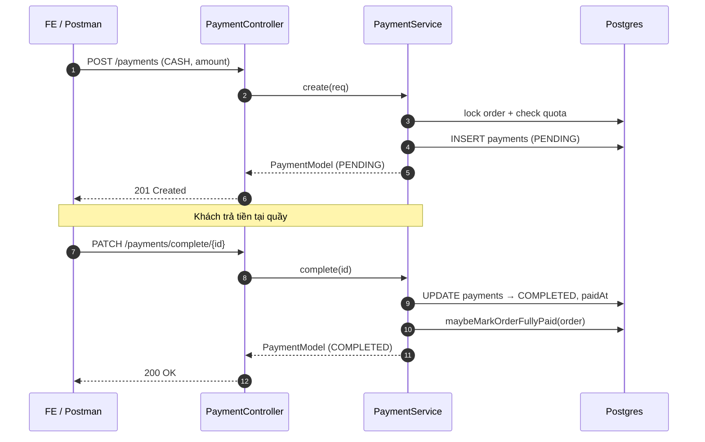
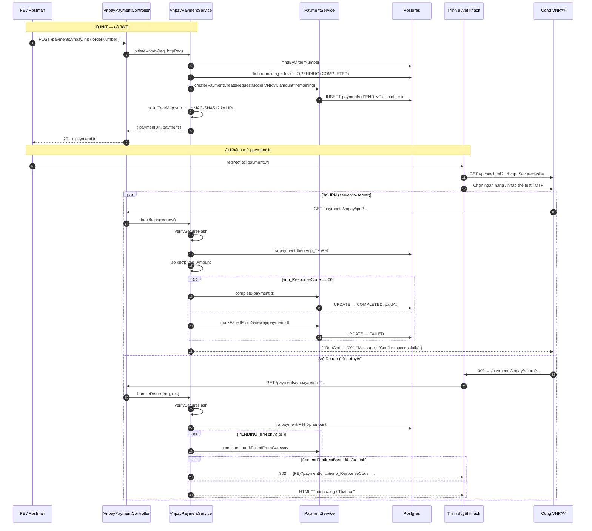
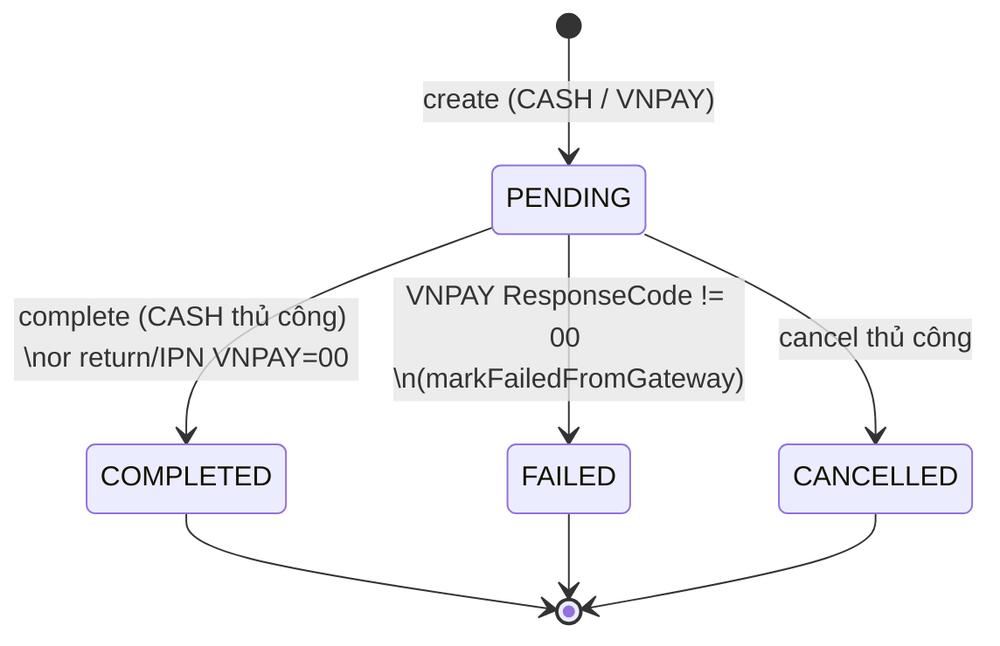

# Payment & VNPAY — Hướng dẫn module

Tài liệu này mô tả module thanh toán của backend: API hiện có, sơ đồ luồng tiền mặt và VNPAY, cách ký URL gửi sang cổng, cách verify Return / IPN, và các điểm cấu hình.

---

## 1. Sơ lược kiến trúc

```
┌────────────────────────┐                  ┌──────────────────────────┐
│ FE / Postman (JWT)     │  POST .../init   │ VnpayPaymentController   │
│   (CASHIER/MANAGER/    │ ───────────────► │   /payments/vnpay/init   │
│    ADMIN)              │                  └──────────┬───────────────┘
└──────────┬─────────────┘                             │
           │ paymentUrl                                ▼
           │                                  ┌─────────────────────┐
           │                                  │ VnpayPaymentService │
           │                                  │  - tạo PaymentEntity│
           │                                  │  - tính amount      │
           │                                  │  - ký URL HMAC-SHA512│
           │                                  └──────────┬──────────┘
           ▼                                             │
┌─────────────────────────┐                              ▼
│ Trình duyệt khách hàng  │  GET vpcpay.html?...    ┌─────────────────┐
│ mở paymentUrl           │ ───────────────────────►│  Cổng VNPAY     │
└─────────────────────────┘                          │  (sandbox/prod) │
                                                     └────┬────────────┘
                                                          │
                              ┌───────────────────────────┴───────────────────────────┐
                              │ (1) GET .../return                  (2) GET/POST .../ipn (server-to-server) │
                              ▼                                       ▼
                ┌────────────────────────────┐         ┌────────────────────────────┐
                │ VnpayPaymentController     │         │ VnpayPaymentController     │
                │ /payments/vnpay/return     │         │ /payments/vnpay/ipn        │
                └────────────┬───────────────┘         └────────────┬───────────────┘
                             ▼                                       ▼
                ┌────────────────────────────┐         ┌────────────────────────────┐
                │ verify hash → sync         │         │ verify hash → cập nhật     │
                │ payment (dự phòng nếu IPN  │         │ COMPLETED / FAILED         │
                │ chưa tới) → HTML / redirect│         │ (idempotent)               │
                └────────────────────────────┘         └────────────────────────────┘
```

Tóm tắt:

- **`/init`** là API duy nhất do **ứng dụng** gọi chủ động cho luồng VNPAY (có JWT, RBAC).
- **`/return`** và **`/ipn`** là **điểm tiếp nhận**:
  - `return`: do **trình duyệt khách** mở sau khi rời cổng VNPAY (redirect).
  - `ipn`: do **máy chủ VNPAY** gọi server-to-server.
- **`PaymentController`** quản lý CRUD chung (CASH + xem/hủy).

---

## 2. Bảng API

### 2.1. Thanh toán chung — `PaymentController` (`/payments`)

| Method | Path | Roles | Mục đích |
|--------|------|-------|----------|
| `GET`  | `/payments/filters` | CASHIER / MANAGER / ADMIN | Lọc + phân trang `payments` theo `id`, `orderId`, `cashierId`, `paymentMethod`, `amount`, `paymentStatus`, `transactionId`. |
| `POST` | `/payments` | CASHIER / MANAGER / ADMIN | **Tạo thanh toán** (`PaymentCreateRequestModel`). Dùng cho **CASH**; với VNPAY thì service này được gọi nội bộ từ `/init`. |
| `PATCH`| `/payments/complete/{paymentId}` | CASHIER / MANAGER / ADMIN | Hoàn tất PENDING → COMPLETED. Dùng cho **CASH**; VNPAY tự hoàn tất qua return/IPN. |
| `PATCH`| `/payments/cancel/{paymentId}` | CASHIER / MANAGER / ADMIN | Huỷ PENDING → CANCELLED. Cả CASH và VNPAY (khi khách chưa thanh toán). |

`PaymentCreateRequestModel`:

```json
{
  "orderId": 1,
  "cashierId": 2,
  "paymentMethod": "CASH",
  "amount": 250000
}
```

### 2.2. Cổng VNPAY — `VnpayPaymentController` (`/payments/vnpay`)

| Method | Path | Auth | Vai trò trong luồng |
|--------|------|------|---------------------|
| `POST` | `/payments/vnpay/init` | JWT (CASHIER/MANAGER/ADMIN) | **Khởi tạo** giao dịch VNPAY: tạo `PaymentEntity` PENDING + ký + trả `paymentUrl` để FE mở. |
| `GET`  | `/payments/vnpay/return` | Public (đã verify hash trong service) | **Tiếp nhận redirect** từ VNPAY khi user rời cổng. Đồng bộ trạng thái dự phòng nếu IPN chưa tới, trả HTML hoặc redirect FE. |
| `GET`/`POST` | `/payments/vnpay/ipn` | Public | **Server-to-server** từ VNPAY. Nguồn xác nhận chính → cập nhật COMPLETED/FAILED, idempotent. |

`VnpayInitRequestModel`:

```json
{ "orderNumber": "ORD-1778337022700" }
```

Phản hồi `VnpayCheckoutResponse`:

```json
{
  "paymentUrl": "https://sandbox.vnpayment.vn/paymentv2/vpcpay.html?...&vnp_SecureHash=...",
  "payment": {
    "id": 5,
    "orderNumber": "ORD-1778337022700",
    "cashierFullname": "admin",
    "paymentMethod": "VNPAY",
    "amount": 864000,
    "paymentStatus": "PENDING",
    "transactionId": "5",
    "paidAt": null
  }
}
```

> **Lưu ý quan trọng:** FE/Postman **không gọi** `/return` hay `/ipn` thủ công. Đó là điểm tiếp nhận từ phía VNPAY hoặc trình duyệt.

---

## 3. Sơ đồ luồng chi tiết

### 3.1. Tiền mặt (CASH)



### 3.2. VNPAY — toàn bộ luồng



> **Hai luồng song song** (Return + IPN) làm cho trạng thái payment chính xác kể cả khi user đóng tab trước khi quay lại. `complete()` và `markFailedFromGateway()` đều **idempotent** (chỉ tác động khi đang PENDING).

### 3.3. Vòng đời trạng thái `PaymentStatus`



---

## 4. Cấu hình

### 4.1. `application.properties` (mặc định, không chứa secret)

```
vnpay.payment-url=${VNPAY_PAYMENT_URL:https://sandbox.vnpayment.vn/paymentv2/vpcpay.html}
vnpay.return-url=${VNPAY_RETURN_URL:http://localhost:8080/payments/vnpay/return}
vnpay.ipn-url=${VNPAY_IPN_URL:http://localhost:8080/payments/vnpay/ipn}
vnpay.frontend-redirect-base=${VNPAY_FRONTEND_REDIRECT_BASE:}
```

### 4.2. `application-local.properties` (gitignore, chứa secret dev)

```
vnpay.tmn-code=PDUGJQUL
vnpay.hash-secret=O71SHM5M7XCCU1NFPTYFBTOBTS7OMBCB
```

File này được nạp tự động qua `spring.config.import=optional:classpath:application-local.properties` ở `application.properties` (không cần `spring.profiles.active=local`).

### 4.3. Biến môi trường (production)

Đặt `VNPAY_TMN_CODE`, `VNPAY_HASH_SECRET`, `VNPAY_PAYMENT_URL`, `VNPAY_RETURN_URL`, `VNPAY_IPN_URL`, `VNPAY_FRONTEND_REDIRECT_BASE`.

> **Lưu ý:** Biến môi trường (kể cả rỗng) **ghi đè** giá trị trong `application-local`. Khi gỡ lỗi "Sai chữ ký", kiểm tra cả env.

### 4.4. Merchant Admin (sandbox / prod)

- Khai báo **Return URL** trùng `vnpay.return-url`.
- Khai báo **IPN URL** trùng `vnpay.ipn-url`. Sandbox/Prod cần URL **HTTPS public** (ngrok / domain thật), VNPAY không gọi được `localhost`.
- Lấy lại **Hash Secret** ở mục cấu hình kết nối (KHÔNG dùng bản mail cũ nếu đã đổi).

---

## 5. Ký HMAC-SHA512 — luồng tạo URL

Theo tài liệu VNPAY 2.1.0 (xem `pay.html`):

1. Đưa toàn bộ tham số `vnp_*` (trừ `vnp_SecureHash`, `vnp_SecureHashType`) vào `TreeMap` để **sort theo tên alphabet**.
2. Bỏ tham số có giá trị rỗng.
3. Ghép chuỗi ký: `name=URLEncoder.encode(value, UTF-8)`, nối bằng `&`. **Giá trị phải encode**, không phải chuỗi thô.
4. `vnp_SecureHash = HMAC_SHA512(hashSecret, signData)` (hex thường).
5. Build URL cuối: `vpcpay.html?` + query (encode key + value) + `&vnp_SecureHash=...`.

Các hằng cố định trong code (`VnpayPaymentServiceImpl`):

| Tham số | Giá trị |
|---------|---------|
| `vnp_Version` | `2.1.0` |
| `vnp_Command` | `pay` |
| `vnp_CurrCode` | `VND` |
| `vnp_Locale` | `vn` |
| `vnp_OrderType` | `other` |
| Múi giờ tạo / hết hạn | `Asia/Ho_Chi_Minh`, format `yyyyMMddHHmmss`, expire = now + 15 phút |
| `vnp_Amount` | `amount.setScale(2, HALF_UP).movePointRight(2)` (×100) |
| `vnp_TxnRef` | `payment.id` (cũng dùng làm `transactionId`) |
| `vnp_OrderInfo` | `Thanh toan don hang #<orderId>, ma giao dich <paymentId>` (≤ 255 ký tự) |

`VnpaySignatureUtils` cung cấp ba hàm chính:

- `buildSignData(params)` — sort + encode + ghép.
- `hmacSha512Hex(secret, signData)` — HMAC-SHA512 → hex.
- `verifySecureHash(params, secret)` — dùng cho Return / IPN: lấy `vnp_SecureHash` ra, tái tạo chuỗi ký rồi so sánh (case-insensitive).

---

## 6. Logic nghiệp vụ quan trọng

### 6.1. `amount` gửi sang VNPAY (tính tại server)

```
remaining = order.totalAmount − Σ(payment.amount khi paymentStatus ∈ {PENDING, COMPLETED})
```

- Nếu `remaining ≤ 0` → từ chối init (đã có khoản PENDING hoặc đã đủ tiền).
- FE **không** truyền `amount`; chỉ truyền `orderNumber`.

### 6.2. Cashier

- Lấy từ **user đăng nhập** (`SecurityContext`) → set vào `cashierId` cho `PaymentEntity`.
- Trong response init: trường `cashierFullname` chính là `users.fullname` của người này. Khác với `waiter_id` trên đơn (đó là phục vụ bàn).

### 6.3. Idempotent Return / IPN

- `complete(paymentId)` yêu cầu trạng thái đang `PENDING`. Trong Return / IPN, kiểm tra trước khi gọi để không lỗi 403 khi cả hai luồng cùng đến.
- IPN luôn trả `RspCode = 00` khi đã từng xử lý (kể cả COMPLETED/FAILED trước đó) để VNPAY dừng retry.

### 6.4. Order tự động COMPLETED khi đủ tiền

Trong `PaymentServiceImp.maybeMarkOrderFullyPaid`:

- Khi tổng `paymentStatus=COMPLETED` của một đơn bằng `order.totalAmount`, và `orderStatus ∈ {READY, SERVED}` → tự chuyển `orderStatus` sang **COMPLETED** qua `OrderStatusTransitionUtils.applyOrderStatusTransition` (đặt `completedAt`).

---

## 7. Phân quyền & bảo mật

| Path | Quyền |
|------|-------|
| `/payments/vnpay/init` | JWT + role `CASHIER`, `MANAGER`, `ADMIN`. |
| `/payments/vnpay/return` | **Public** (đã loại khỏi `JwtAuthFilter`). Bảo vệ bằng **verify HMAC**. |
| `/payments/vnpay/ipn` | **Public** (đã loại khỏi `JwtAuthFilter`). Bảo vệ bằng **verify HMAC**. |
| `/payments/*` còn lại | JWT + role tương ứng. |

`SecurityConfig` whitelist `/payments/vnpay/return` và `/payments/vnpay/ipn`; `JwtAuthFilter` bỏ qua hai path này.

---

## 8. Cấu hình test sandbox (mail mẫu)

```
TMN code     : PDUGJQUL
Hash secret  : O71SHM5M7XCCU1NFPTYFBTOBTS7OMBCB
Payment URL  : https://sandbox.vnpayment.vn/paymentv2/vpcpay.html
Merchant adm : https://sandbox.vnpayment.vn/merchantv2/
Thẻ test     : NCB 9704198526191432198 / NGUYEN VAN A / 07/15 / OTP 123456
```

Sandbox **không đảm bảo** mọi app NH thật quét được QR; nên test bằng **thẻ ATM/Napas** trong giao diện thanh toán.

---

## 9. Gỡ lỗi nhanh

| Triệu chứng | Nguyên nhân thường gặp |
|-------------|-----------------------|
| **"Sai chữ ký"** trên trang VNPAY | `hashSecret` không khớp với secret đang lưu cho `TMN` trong Merchant Admin; biến env ghi đè `application-local`; lệch khoảng trắng / xuống dòng khi copy. |
| Init OK nhưng trả về `tmnCodeLen=0` / `hashSecretLen=0` | Không nạp `application-local.properties` (file bị `.gitignore` mà bản build không có), hoặc env rỗng đè lên. |
| `return` báo "Sai chữ ký" | Tham số bị sửa giữa đường (proxy?), hoặc đã đổi secret giữa init và return. |
| `IPN` không được gọi | Sandbox không gọi được `localhost` → cần URL public (ngrok / domain). |
| Payment vẫn `PENDING` sau khi thanh toán | Cả Return chưa tới và IPN public chưa cấu hình → trạng thái không được đồng bộ. |
| QR sandbox báo "người bán không tồn tại" khi quét bằng app NH thật | App NH thật không map merchant test → dùng thẻ test trên web; production sẽ ổn. |

Log info khi `/init` đã in:

```
VNPAY init: tmnCodeLen=8, hashSecretLen=32
```

→ Kiểm tra nhanh đã có cấu hình đúng độ dài (TMN VNPAY thường 8 ký tự, secret 32 ký tự).

---

## 10. Triển khai lên production

1. Đăng ký TMN production, lấy Hash Secret production.
2. Đặt biến môi trường:
   - `VNPAY_TMN_CODE`, `VNPAY_HASH_SECRET`
   - `VNPAY_PAYMENT_URL=https://pay.vnpay.vn/vpcpay.html`
   - `VNPAY_RETURN_URL=https://<domain>/payments/vnpay/return`
   - `VNPAY_IPN_URL=https://<domain>/payments/vnpay/ipn`
   - `VNPAY_FRONTEND_REDIRECT_BASE=https://<frontend-domain>/payment-result` (tuỳ chọn)
3. Khai báo Return URL + IPN URL trên Merchant Admin production, **trùng từng ký tự**.
4. Khoá HTTPS, đặt server sau reverse proxy → ip thật lấy qua `X-Forwarded-For` (đã xử lý sẵn `resolveClientIp`).
5. Bật giám sát: alert khi log `VNPAY IPN invalid signature`, `VNPAY return invalid signature`, hoặc payment ở `PENDING` > N phút.

---

## 11. Mapping nhanh thông số

| Tham số VNPAY | Nguồn trong code |
|---------------|------------------|
| `vnp_TmnCode` | `VnpayProperties.tmnCode` |
| `vnp_Amount` | `payment.amount * 100` (BigDecimal → long) |
| `vnp_TxnRef` | `payment.id` (cũng lưu vào `payments.transaction_id`) |
| `vnp_OrderInfo` | `"Thanh toan don hang #<orderId>, ma giao dich <paymentId>"` |
| `vnp_ReturnUrl` | `VnpayProperties.returnUrl` |
| `vnp_IpAddr` | `X-Forwarded-For` nếu có, ngược lại `request.remoteAddr` |
| `vnp_CreateDate` / `vnp_ExpireDate` | now / now+15p (giờ VN) |
| `vnp_SecureHash` | `HMAC-SHA512(hashSecret, signData)` |
